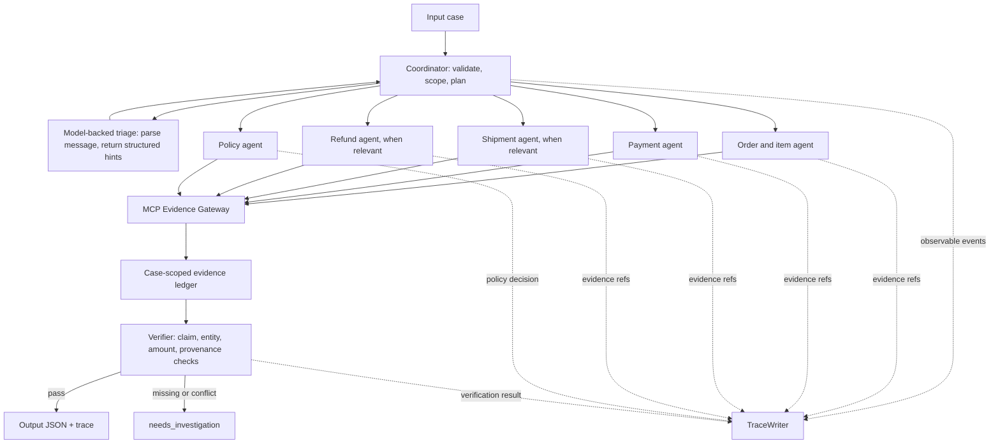

# L3A Agent Architecture

Tài liệu này mô tả kiến trúc cho bộ giải khiếu nại thương mại điện tử L3A. Mục tiêu là kết luận có thể kiểm chứng từ MCP evidence, giữ đúng phạm vi từng case và tạo output cùng trace theo public contract. Nội dung trace chỉ ghi sự kiện quan sát được, không ghi prompt hay suy luận riêng.

## 1. Mục tiêu và nguyên tắc

- Customer message và claim là điều cần xác minh, không phải dữ kiện chuẩn.
- MCP Evidence Gateway là nguồn có thẩm quyền cho order, item, payment, shipment, seller, refund và policy.
- Mỗi MCP request luôn mang `case_id` của case đang giải. Không dùng lại evidence ref giữa case.
- Mỗi kết luận phải trỏ tới một hoặc nhiều evidence ref thực sự hỗ trợ nó.
- Thiếu hoặc mâu thuẫn evidence dẫn đến `needs_investigation` / `insufficient_evidence`, không tự điền giá trị.
- Policy là nguồn quyết định quyền lợi và hành động. Agent nghiệp vụ xác minh sự kiện; policy agent áp dụng rule lên sự kiện đã xác minh.
- Mô hình ngôn ngữ phải dưới 10 tỷ tham số; mô hình chỉ hỗ trợ phân loại/ngôn ngữ, còn kết luận nghiệp vụ phải được xác minh bằng MCP và policy.

## 2. Luồng hệ thống



`solve_case()` là entry point. Các agent là vai trò logic được điều phối trong cùng process; không cần khởi chạy dịch vụ hoặc framework agent riêng. Giao tiếp giữa vai trò dùng message envelope nội bộ. MCP calls vẫn đi qua `EvidenceGateway` để validate response trước khi workflow dùng evidence.

## 3. Agent ownership và quyền MCP

| Actor | Input | Tool được phép gọi | Trách nhiệm | Handoff |
| --- | --- | --- | --- | --- |
| Coordinator | Case JSON, tool inventory | Không gọi evidence tool trực tiếp | Kiểm tra `case_id`, `claimed_order_id`, claims và `policy_version`; lập kế hoạch theo claim; giữ evidence ledger cho một case | Giao các yêu cầu có cùng `case_id` tới specialist; chuyển kết quả sang verifier |
| Order/item agent | Order ID và case scope | `get_order`, `get_order_items`, `get_sellers`, `get_product_context` | Xác minh trạng thái order, item, seller và product liên quan; trả về entity IDs cùng refs | Gửi order facts và refs cho shipment, policy, verifier |
| Payment agent | Order ID và case scope | `get_order_payments`, `get_payment_timeline` | Đối chiếu các khoản thanh toán và sự kiện capture theo amount, type, thời điểm; không coi các dòng payment cùng `payment_sequential` là trùng charge nếu amount hoặc lifecycle cho thấy đó là dòng hợp lệ riêng | Gửi payment facts và refs cho refund, policy, verifier |
| Shipment agent | Order ID, item facts nếu có | `get_shipment_summary` | Xác định mốc giao, cam kết giao, seller handoff và sự kiện vận chuyển; chỉ gán trách nhiệm khi timeline hỗ trợ | Gửi shipment facts và refs cho policy, verifier |
| Refund agent | Order ID, payment facts khi có | `get_refund_timeline` | Xác minh refund đã tạo, đang pending, thất bại hay hoàn tất; phân biệt trạng thái refund với khoản thanh toán gốc | Gửi refund facts và refs cho policy, verifier |
| Policy agent | Policy version và facts từ specialists | `get_policy` | Tải policy đúng version; áp dụng rule cho issue đã xác minh; trả status, hành động, số tiền và bên chịu trách nhiệm cùng policy ref | Gửi quyết định policy và ref cho verifier |
| Verifier | Agent results, evidence ledger | Không gọi tool theo mặc định | Kiểm tra scope, claim linkage, refs, tổng tiền, party/action/status consistency và schema trước khi finalize | Pass thì tạo output; fail thì yêu cầu specialist bổ sung một lần hoặc kết luận cần điều tra |

Các tool ít dùng hơn được gọi có điều kiện: `get_customer_history` chỉ khi specialist có `customer_unique_id` đáng tin cậy từ evidence; `get_product_context` khi claim phụ thuộc danh tính/category sản phẩm. Không suy ra `customer_unique_id` từ ID có hình dạng tương tự.

## 4. Kế hoạch evidence theo nhóm issue

Coordinator luôn yêu cầu order, items, payments và policy vì đây là các nhóm cốt lõi để gắn entity, kiểm tra số tiền và áp dụng rule. Các tool bổ sung:

| Claim topic | Evidence bổ sung |
| --- | --- |
| `canceled_order_paid` | `get_payment_timeline`; kiểm tra order status từ `get_order` và capture thực tế |
| `unavailable_order_paid` | `get_sellers`, `get_payment_timeline`; đối chiếu trạng thái order, seller và payment |
| `late_delivery_seller` | `get_shipment_summary`, `get_sellers`; so sánh mốc seller handoff với hạn giao cho seller |
| `late_delivery_logistics` | `get_shipment_summary`; dùng timeline để tách trễ trước và sau khi đơn được bàn giao |
| `valid_split_payment` | `get_payment_timeline`; cộng các capture được xác nhận và so với order total |
| `payment_mismatch` | `get_payment_timeline`; đối chiếu payment rows, capture events và order total |
| `duplicate_charge` | `get_payment_timeline`; cần hai capture riêng biệt có bằng chứng, không kết luận từ nhiều dòng payment đơn thuần |
| `refund_pending`, `refund_failed` | `get_refund_timeline`; nếu chưa đủ trạng thái, giữ kết luận ở `needs_investigation` |
| `unsupported_claim` | Dùng evidence liên quan claim để chứng minh phạm vi; nếu không có dữ liệu đủ liên quan thì trả thiếu evidence |

`requested_full_refund` là yêu cầu xử lý, không tự nó chứng minh khách được hoàn toàn bộ. Mức hoàn tiền lấy từ policy rule và dữ liệu payment/refund; không suy ra từ câu chữ trong customer message.

## 5. A2A message và trace

Message envelope nội bộ tối thiểu:

```json
{
  "case_id": "L3A_CASE_001",
  "task_id": "payment-review",
  "sender": "coordinator",
  "recipient": "payment-agent",
  "order_id": "<order id from input>",
  "claim_ids": ["claim-001-a"],
  "evidence_refs": []
}
```

Mỗi message giữ nguyên `case_id`; recipient chỉ nhận dữ liệu cần cho nhiệm vụ. Specialist trả facts đã chuẩn hóa, tool names và evidence refs, không trả chain-of-thought. Handoff là một chiều theo đồ thị `coordinator → specialist → policy/verifier`; verifier không tự gọi lại agent theo vòng lặp. Cho phép tối đa một yêu cầu bổ sung cho specialist khi verifier chỉ rõ thiếu evidence nào.

Trace dùng các event public: `case_received`, `task_assigned`, `tool_result_consumed`, `handoff`, `policy_decided`, `verification_completed`, `case_finalized`. `tool_result_consumed` phải ghi actor sở hữu tool và ref gốc từ MCP. Các event không chứa nội dung khách hàng nhạy cảm, token API, prompt hoặc suy luận riêng.

## 6. Evidence lifecycle

1. Gateway discovery tool từ MCP trước khi xử lý case; workflow không đoán tool name nếu tool không có trong inventory.
2. Mọi call được scope bằng `case_id` và order/policy identifier từ input hoặc evidence trước đó.
3. Gateway kiểm tra envelope theo `mcp-evidence-response-v1`. Workflow lưu nguyên `evidence_ref` và `result_hash`; không chỉnh sửa hay tự tạo ref.
4. Evidence ledger chỉ tồn tại trong một lần `solve_case()`. Mỗi claim assessment chứa refs liên quan; top-level `evidence_refs` chỉ gồm refs đã dùng.
5. Verifier kiểm tra các ref trong output tồn tại trong ledger hiện tại và claim được gắn evidence phù hợp.
6. Trace ghi `tool_result_consumed` ngay sau khi workflow nhận và sử dụng evidence.

## 7. Failure policy

| Failure | Retry | Fallback | Trace / output |
| --- | --- | --- | --- |
| Timeout hoặc lỗi kết nối MCP | Tối đa 1 retry cho read call, với cùng arguments; không retry vô hạn | Nếu nhóm evidence bắt buộc vẫn thiếu, không kết luận issue hoặc refund dựa trên phỏng đoán | Không emit `tool_result_consumed` khi không có response; verifier trả `insufficient_evidence` |
| Tool không tìm thấy entity | Không retry cùng request | Giữ entity theo dữ kiện đã có; không thay bằng ID đoán | Ghi event phù hợp; kết luận `needs_investigation` khi thiếu nhóm bắt buộc |
| MCP trả lỗi hoặc envelope không hợp lệ | Không retry lỗi validation; lỗi tạm thời chỉ retry theo quy tắc timeout | Bỏ response không hợp lệ, không dùng ref | Không ghi ref lỗi vào output; đánh dấu evidence thiếu |
| Nhiều nguồn authoritative bất đồng | Không retry | Giữ từng nguồn, không tự chọn bên đúng nếu policy không quy định ưu tiên | Thêm `data_conflicts`; hạ confidence hoặc `needs_investigation` |
| Specialist output thiếu ref hoặc sai scope | Một lần handoff sửa nếu chỉ thiếu dữ liệu có thể lấy được | Từ chối kết quả specialist không đạt contract | `verification_completed` ghi decision code thất bại; không finalize kết luận thiếu căn cứ |
| Policy version không có rule | Không retry cùng version | Không áp policy version khác | `needs_investigation`, refund 0 cho tới khi xác minh được policy |

## 8. Verification invariants trước finalize

- Output `case_id` bằng input `case_id`; mọi MCP response và trace event cùng case.
- Output qua `l3a-output-v2`; danh sách evidence ref duy nhất, có thật và nằm trong audit scope hiện tại.
- Mỗi claim có verdict, confidence trong `[0, 1]` và evidence ref liên quan; claim chưa có bằng chứng không được đánh dấu supported.
- `recommended_refund_brl` bằng tổng `refund_lines[].amount_brl`; tiền tệ là BRL; không trả vượt mức policy hoặc số tiền thực trả đủ điều kiện.
- `case_status`, `primary_issue`, `resolution_actions` và `responsible_parties` phải cùng một kết luận policy.
- Seller chỉ được nêu là bên chịu trách nhiệm khi seller ID được MCP trả về và timeline cho thấy điểm trễ thuộc seller.
- Duplicate charge yêu cầu bằng chứng cho nhiều capture riêng; nhiều payment row không đủ để kết luận.
- Confidence phản ánh độ đầy đủ và độ nhất quán evidence; thiếu evidence hoặc conflict phải làm giảm confidence.
- Trace có `case_received` trước `case_finalized`, có assignment/handoff, verification, và actor cùng evidence ref khớp các MCP call đã dùng.

## 9. Chọn và sử dụng model

Yêu cầu của đề là model dưới 10B tham số. Backend online đang chọn **LiquidAI LFM2.5-2.6B** qua OpenRouter (`liquid/lfm-2.5-2.6b:free`). Model card công bố tổng 2.69B tham số và hỗ trợ tiếng Việt. Model `qwen/qwen3-8b:free` được đề xuất ban đầu đã trả lỗi 404 từ API OpenRouter, nên không dùng trong bản chạy thử. Nếu chạy local trên máy có đủ tài nguyên, Qwen3-8B (8.2B) vẫn là lựa chọn dưới 10B. [LiquidAI model card](https://huggingface.co/LiquidAI/LFM2.5-2.6B), [OpenRouter free model](https://openrouter.ai/liquid/lfm-2.5-2.6b:free), [Qwen3-8B model card](https://huggingface.co/Qwen/Qwen3-8B)

Model chạy sau coordinator dưới dạng `ModelTriageClient` gọi OpenRouter API. Cấu hình nằm ở `MODEL`, `OPENROUTER_BASE_URL` và `OPENROUTER_API_KEY` trong `.env`. Client chỉ gửi message và claim ID/topic của case hiện tại; không gửi Team API Key, order ID, MCP evidence hay dữ liệu case khác vào model endpoint. Chốt model ID và revision khi chốt môi trường thi.

Model triage trả JSON gồm `summary`, `focus_claim_id` và `risk_flags` thuộc tập `payment`, `shipment`, `refund`, `seller`. Vì input đã có claim topic, model không được phép ghi đè topic chỉ dựa trên câu chữ khách hàng. Coordinator có thể dùng risk flags hợp lệ để thêm tool liên quan; kết luận cuối phải dựa trên response MCP đã validate và policy version của case.

Model không được quyết định hoặc tự tạo `evidence_ref`, entity ID, trách nhiệm, tình trạng thanh toán/refund, số tiền, `case_status` cuối cùng hay `resolution_actions`. Không đưa chain-of-thought vào output/trace. Dùng structured JSON output, temperature 0 và giới hạn output ngắn; nếu parse/schema lỗi, bỏ triage result và tiếp tục bằng claim topic có sẵn cùng quy tắc deterministic. Như vậy model hỗ trợ hiểu ngôn ngữ nhưng không thay thế nguồn evidence.

## 10. Reproducibility và triển khai

- Python `>=3.11`; dependencies và version range được khai báo trong `pyproject.toml`.
- Coordinator và specialists chạy tuần tự trong một process ở phiên bản hiện tại. Chỉ tăng concurrency sau khi bảo đảm các event trace vẫn đúng thứ tự và MCP audit hỗ trợ các call đồng thời.
- Không dùng random/model generation cho quyết định số tiền hoặc trách nhiệm. Event ID ngẫu nhiên chỉ dùng để thỏa trace contract.
- Ghi model ID, revision, backend, quantization, context limit và decoding config trong bản ghi triển khai; không ghi API key. Không đổi model giữa một run.
- Chạy: `day09 validate-inputs`, `day09 mcp-tools`, `day09 run`, `day09 validate`, `day09 package --output dist/submission.zip`.
- Input, output và trace phụ thuộc release input, policy version, tool inventory và Team API Key cấu hình cục bộ; không ghi API key trong tài liệu, output hay ZIP.

## 11. Trạng thái hiện thực

`src/student_agent/workflow.py` hiện là một coordinator chạy tuần tự, phát trace events dưới tên actor specialist và gọi `ModelTriageClient` khi cấu hình model có sẵn. Đây là mô phỏng handoff A2A trong cùng process; chưa có transport A2A giữa các tiến trình. `day09 sample` tạo output, triage và trace của một case riêng trong `demo/`, không đụng tới `outputs/` và `traces/` của lần chạy 100 case.

Workflow hiện chọn evidence ref theo từng claim và xác minh dấu hiệu nghiệp vụ trước khi gán verdict; `unsupported_claim` lấy thêm shipment evidence. Sự kiện có thời điểm sau `opened_at` không được dùng để chứng minh claim tại thời điểm mở case. Seller ID trong kết luận được đối chiếu với order items và sellers của case; xung đột liên quan làm giảm confidence theo mức nhỏ. `day09 run --resume` giữ các case đã hoàn tất khi MCP gián đoạn, sau đó ghép trace theo thứ tự case.
